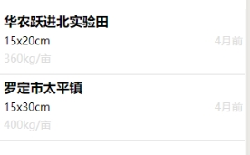
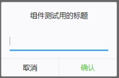
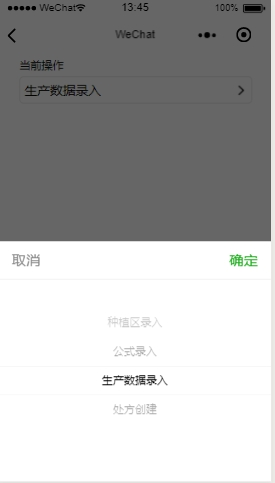
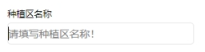
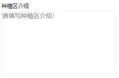

# wx-ui
自用的小程序组件库

所有组件代码均放在wx-ui/components下

# 各部件介绍

## v-list

（1）名称：v-list

（2）用途：信息列表展示

（3）参数

|参数名称   |类型        |说明                 |举例                                                   |
|----------|------------|---------------------|------------------------------------------------------|
|info      |Array       |需要展示的信息列表数组 |`info: [{ title: "xx", length: "xx", size: "xx", time: "xx" }`] |

（4）样例



## v-modal

（1）名称：v-modal

（2）用途：弹窗式的单行文本输入框

（3）参数

|参数名称   |类型        |说明             |
|----------|------------|----------------|
|title     |String      |输入框提示语     |

（4）样例



（5）说明

①若需要该组件传回用户输入的信息，可在组件上绑定监听函数：

```html
<!--pages/v-modal/v-modal.wxml-->
<v-modal title="{{title}}" bind:modalValue="receiveModalValue"></v-modal>
```

```js
// pages/v-modal/v-modal.js
Page({
  data: {
    title: "组件测试用的标题",
    value: "无"
  },
  receiveModalValue: function (e) {
    this.setData({
      value: e.detail
    })
  }
})
```

②该组件需要用到wx-ui/components下的inputbox组件

## v-picker-multiSelector

（1）名称：v-picker-selector

（2）用途：单列选择器

（3）参数

|参数名称      |类型        |说明                |
|-------------|------------|--------------------|
| title       |String      |选择器头上的提示语   |
|options      |Array       |选项数组            |

（4）样例



（5）说明

若需要该组件传回用户输入的信息，可在组件上绑定监听函数：

```html
<!--pages/v-picker-selector/v-picker-selector.wxml-->
<v-picker-selector 
options="{{operateOptions}}" 
title="{{operateOptionsTitle}}" 
bind:optionsValue="receiveOperateOptionsValue"></v-picker-selector>
```

```js
// pages/v-picker-selector/v-picker-selector.js
data: {
    operateOptions: ["种植区录入", "公式录入", "生产数据录入", "处方创建"],
    operateOptionsTitle: '当前操作',
    operateOptionsIndex: 0
  },
receiveOperateOptionsValue: function (e) {
    //console.log(e.detail)
    this.setData({
      operateOptionsIndex: e.detail
    })
  }
```

## v-text

（1）名称：v-text

（2）用途：单行文本输入框

（3）参数：

|参数名称      |类型        |说明                |
|-------------|------------|--------------------|
| title       |String      |文本框头上的提示语   |
|placeholder  |String      |提示语              |

（4）样例



（5）说明

若需要该组件传回用户输入的信息，可在组件上绑定监听函数：

```html
<!--pages/v-text/v-text.wxml-->
<v-text 
title="{{title2}}" 
placeholder="{{placeholder1}}" 
bind:textValue="receiveTextValue" 
value="{{plantingAreaName}}"></v-text>
```

```js
data: {
    title2: '种植区名称',
    placeholder1: '请填写种植区名称！',
    plantingAreaName: '' 
  },
receiveTextValue: function (e) {
    this.setData({
      plantingAreaName: e.detail
    })
  }
```

## v-textarea

（1）名称：v-textarea

（2）用途：多行文本输入框

（3）参数

|参数名称      |类型        |说明                |
|-------------|------------|--------------------|
| title       |String      |文本框头上的提示语   |
|placeholder  |String      |提示语              |

（4）样例



（5）说明

若需要该组件传回用户输入的信息，可在组件上绑定监听函数：

```html
<!--pages/v-textarea/v-textarea.wxml-->
<v-textarea 
placeholder="{{placeholder2}}" 
title="{{title3}}" 
value="{{plantingAreaIntroduction}}" 
bind:textareaValue="receiveTextareaValue"></v-textarea>
```

```js
// pages/v-textarea/v-textarea.js
data: {
    title3: '种植区介绍',
    placeholder2: '请填写种植区介绍！',
    plantingAreaIntroduction: ''
  },

    receiveTextareaValue: function (e) {
    this.setData({
      plantingAreaIntroduction: e.detail
    })
    //console.log(this.data.plantingAreaIntroduction)
  }
```


